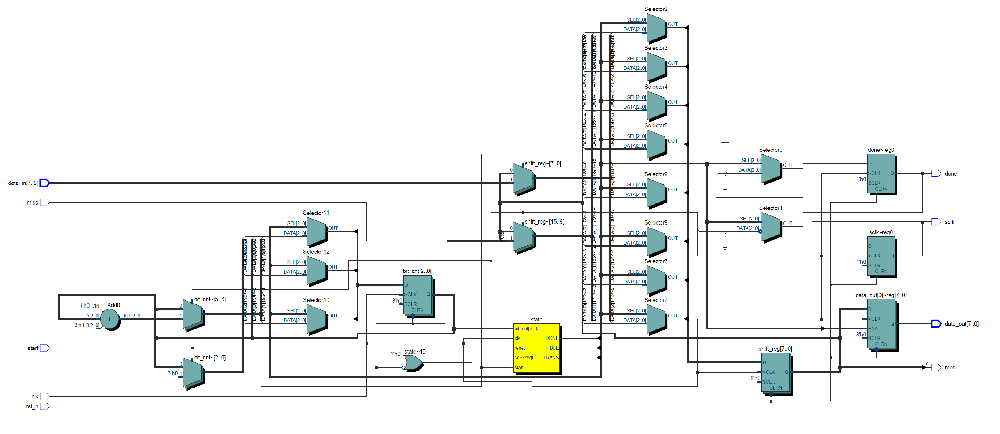
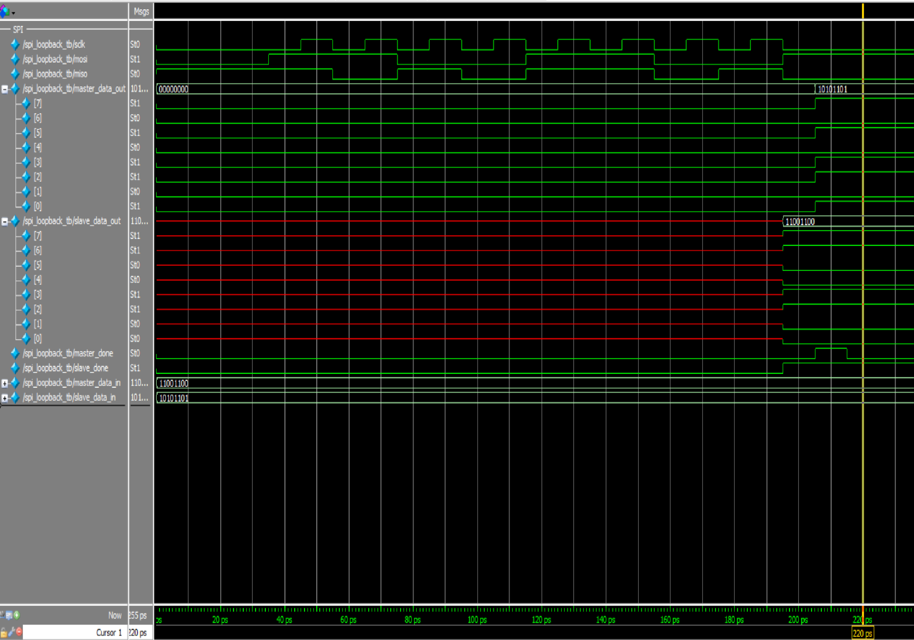

# SPI Loopback Testbench

This project implements and verifies a full-duplex SPI master-slave loopback using Verilog. It is simulated and waveform-verified using ModelSim.

---

## 📌 Overview

- **Master sends:** `8'b11001100`
- **Slave responds:** `8'b10101101`
- Loopback connection via `mosi`, `miso`, and `sclk`
- Verified under SPI Mode 0 (`CPOL=0`, `CPHA=0`)
- Simulation tested on **ModelSim** (Intel FPGA Edition)

---

## 🧾 File List

| File               | Description                          |
|--------------------|--------------------------------------|
| `spi_master.v`     | Verilog module for SPI master        |
| `spi_slave.v`      | Verilog module for SPI slave         |
| `spi_loopback_tb.v`| Testbench for loopback verification  |
| `RTL_spi_master.png` | RTL schematic of `spi_master.v`     |
| `wave_spi_loopback_tb.png` | Waveform of simulation result |

---

## 📊 RTL View

RTL schematic of the SPI Master:



---

## 🌊 Waveform Result

Final waveform captured during loopback simulation:



**Expected Data Transfer:**

| Signal           | Value       |
|------------------|-------------|
| `master_data_in` | `11001100`  |
| `slave_data_in`  | `10101101`  |
| `master_data_out`| `10101101` ✅ |
| `slave_data_out` | `11001100` ✅ |

---

## ▶️ How to Run (ModelSim)

```sh
vlog spi_master.v spi_slave.v spi_loopback_tb.v
vsim work.spi_loopback_tb
add wave -r *
run -all
